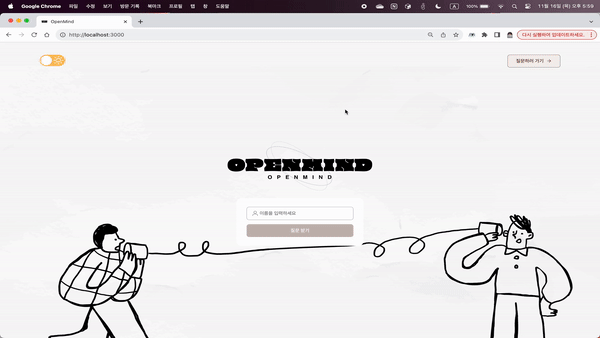

#  Codeit-sprint-team9-openmind

## 노션 & 배포 사이트
<a href="https://sable-wavelength-4a8.notion.site/9-a526328efb6244e9b979f0e513678a04">
  
</a>

[OPENMIND](https://open-mind-nu.vercel.app/)

## 팀원

|<a href="https://github.com/Accept77"> </a>|<a href="https://github.com/zermzerm"></a>|<a href="https://github.com/SoobinJ"></a>|<a href="https://github.com/youdame"></a>|
|:---:|:---:|:---:|:---:|
|<h3>양진수</h3>|<h3>박경서</h3>|<h3>전수빈</h3>|<h3>조유담</h3>|

## 프로젝트 정보

### 개발 기간
> 2023.11.03 ~ 2023.11.17

### 주요 라이브러리

```
eslint / prettier - 문법 교정
react-router-dom - 라우터
axios - api
styled-components - css
mui/material - 페이지 네이션
react-spinners - 로딩 스피너
react-infinite-scroll-component - 무한 스크롤
recoil - 전역 상태 관리
```

### 기술 스택


## 데이터의 흐름


## 개발 중 있었던 문제 및 해결 방법

### 글꼴 문제

- 원인
  - 공용 컴포넌트를 안에 있는 요소가 팀원 따라서 넘치는 현상이 일어남
  - 같은 브라우저인 크롬에서 보지만 운영체제 따라서 다르게 나오는 현상이라고 생각했음
  - 피그마에 지정된 Actor 폰트가 한글을 지원하지 않음
  - 그래서 기본폰트가 적용되고 윈도우와 맥의 크롬에서는 기본 폰트가 달라서 다르게 보임
- 해결
  - 한국어 지원이 되는 Pretendard 폰트로 통합 적용
  - 해당 서비스 언어와 폰트가 지원하는지 확인해야한다

### 여러 개의 로그인 시도에 대한 고민

- 원인
  - Local Storage에 여러 개의 id를 저장해야 하는가
  - 그러면 사용자가 수백 개의 계정을 만들면 Local Storage의 부담이 커진다
  - 사용자가 입력할 때마다 name으로 검색하면 좋겠지만 API에 그런 기능이 없음
  - 모든 사용자를 받아서 반복문을 돌면서 name을 검색 → 사용자가 많으면 문제가 된다.
- 해결
  - / 페이지로 접근 시 Local Storage가 있으면 list 페이지로 이동해 계정 생성 차단
  - answer 페이지로 이동해서 사용자를 삭제하고 이용하도록 에러 처리를 하자

### 에러 처리로 화면 이동할 시 화면이 렌더링 되는 문제

- 원인
  - post 페이지에서 잘못된 접근을 시도 → post 페이지 이동 → list로 이동
  - 검사하고 이동하는 함수가 useEffect 함수 내부에 있다 보니 렌더링을 하면서 동시에 실행함
  - post 페이지 한 곳에서 잘못된 접근 모든 경우의 수를 다뤄주다 보니 post 페이지에 잠깐이라도 들르게 됨
- 해결
  - 바로 페이지로 이동하는 게 아니라 중간에 에러 처리를 분리해서 route에서 처리함
  - 잘못된 접근 시도 시 post 페이지로 이동하지 않고 바로 다른 페이지로 이동

### 페이지네이션 index 1로 고정되는 현상

- 원인
  - ListPage라는 상위 컴포넌트에 CardList, Paginator라는 하위 컴포넌트가 존재하는 상황
  - 특정 페이지를 클릭하면 request 호출로 로딩이 발생 → loading 처리를 ListPage 컴포넌트에서 return문으로 처리해버려서 얼리 리턴으로 인해 Paginator가 언마운트 되었다가 다시 마운트 됨
  - 따라서 데이터가 불러와지면서 로딩이 발생할 때마다 page index의 state가 1로 초기화되어서 1로 고정되는 현상이 발생함
- 해결
  - 데이터가 화면에 보이는 부분은 CardList 컴포넌트이기에
  - 로딩의 대한 처리를 props를 통해 CardList로 넘겨서 처리함

### 좋아요 버튼 연속 클릭

- 원인
  - 좋아요 버튼이나 싫어요 버튼을 연속으로 클릭하면 API 호출이 연속으로 일어나 오류 발생
  - 연속으로 클릭하면 어느 정도 지연되어 실행해야 하지 않을까?
- 해결
  - debounce 함수를 이용해 입력이 지연되어도 1번만 처리되게 함

### 케밥 버튼 바깥 Div 클릭 시 안 사라지는 현상

- 원인
  - 케밥 버튼이 postCard 안에 있어 밖을 클릭하면 postConent로 인식됨
- 해결
  - 가장 밖에 있는 div에 onClick 함수를 넣어 div를 클릭하면 사라짐
  - 하지만 이렇게 동작하면 다른 card의 케밥 구분이 어려움
  - rocoil으로 id값을 저장해 card id와 비교해 해결

## 서비스 시연

### 기본 동작


### 반응형


### 에러 처리


### 다크 모드


